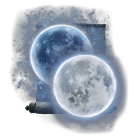

# moonlight

There’s two moons in the air
Dangling by a thread
Twisted and turning 
Colliding into each other
They speak in tongues
Without much knowledge
Of when and how they came to be
I look into the horizon
And watch from afar
For somebody has to stay back
And tend to the wheat grass
