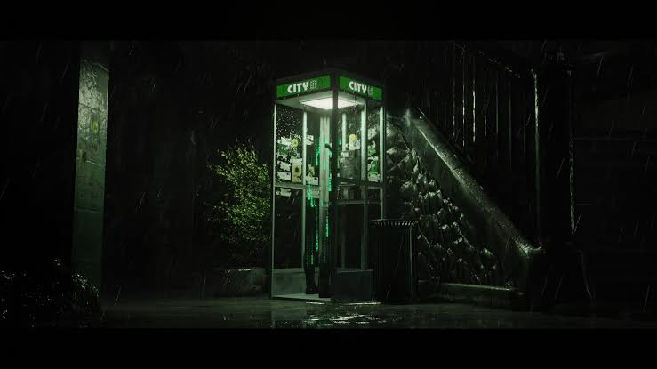

# trapezium


reality is held in balance by</br>
just a few strings, connecting stars in the sky</br>
mankind’s quest for meaning</br>
reveal three thousand realms</br>
in a single moment</br>
or maybe, infinity in a grain of sand</br>
but we all prefer to keep our</br>
third eye blind</br>
wear faces in passing</br>
“Hello, How do you do?”</br>
hiding subtle grins</br>
at the fatalism of it all</br>
that reality might be</br>
but three steps away from the closest</br>
phone booth, dial the number</br>
exitsimulation</br>


```markdown
title: "trapezium"
date: "2024-07-19"
author: "hideodaikoku"
```