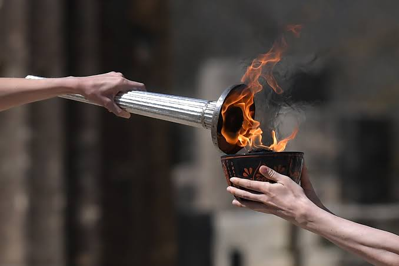

# civilization


kindle the dying ember</br>
so the flame may burn</br>
yet another revolution</br>
the old must leave</br>
what the young can surmise</br>
repeat the cycle</br>
of fire and cinder</br>
who was it?</br>
that started it all</br>
a stone, the wind or the clouds?

```markdown
title: "civilization"
date: "2024-09-18"
author: "hideodaikoku"
```