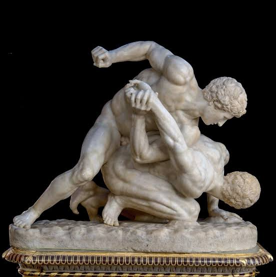

# wrestling

colors of freedom 
liberty and democracy 
run deep in the jingoism 
of daily interactions,  
the quest for freedom 
the desire for order 
but chaos and control 
simply two wrestlers 
in a match, liking fighting vipers 
one taps out until the next round 
and then it’s back to bloodied noses 
with broken teeth, with 
different colors next round

*The Wrestlers - Uffizi Collection*
