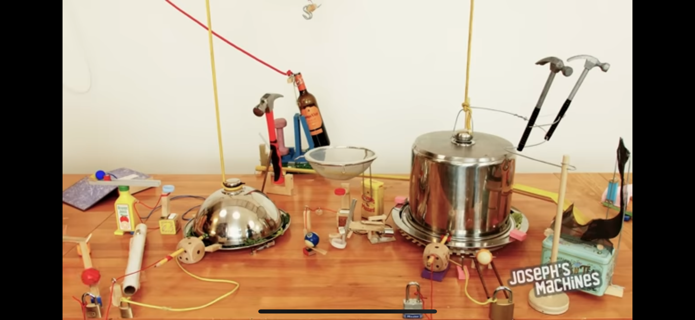

# causality

Systems are composed 
Of rituals 
In nodes and edges 
Not all nodes are weighted equally 
And not all edges are unidirectional 
The system is true 
So long as its starting assumptions 
Hold true, 
analogous to digital signals 
that fluctuate in and out, 
Of tiny vibrations in the ether 
So step back and admire 
The beauty of the system 
What came first? 
The chicken or the nugget? 

*Rube Goldberg Machine by Joseph Herscher *
