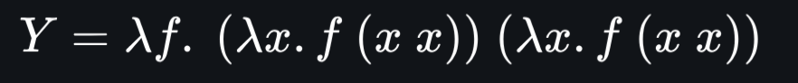

# recursion

two Truths lead to undesirable result 
two Falsities lead to a desirable result 
one Truth with a touch of 
false leads to a desirable outcome 
yet Falsity combined with a touch of  
truth leads to a desirable outcome 
chain the methods 
and you will have 
the combinator
