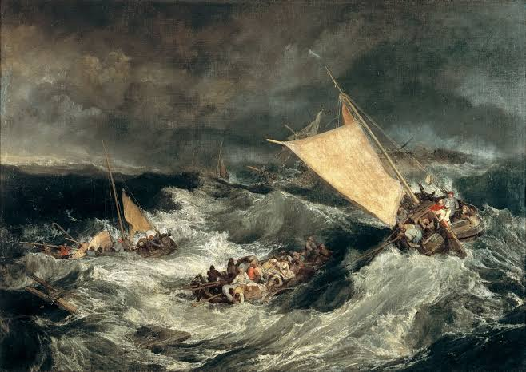

# shoreline

## shoreline

a fishing boat 
with two oars and a  
hole in the bottom 
rocked by salty waves 
of sea water  
floating to the shoreline 
slowly sinking 
I wonder if you mistook me 
for the light house or 
gust of wind 
I am the ocean
