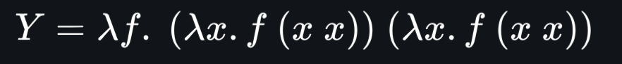

# recursion

two Truths lead to undesirable result
two Falsities lead to a desirable result
one Truth with a touch of 
false leads to a desirable outcome
yet Falsity combined with a touch of 
truth leads to a desirable outcome
chain the methods
and you will have
the combinator
